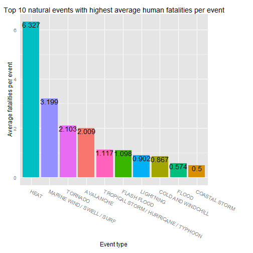

Developing Data Product 
========================================================
US Storm Database Analyzer

Oct 2015

US Storm Database Analyser
========================================================

Coursera [Developing Data Products](https://www.coursera.org/course/devdataprod) course project

Obj : To create a Shiny application and deploy it on Rstudio's servers

Source: Dataset can be obtained from [the Coursera Reproducible Research Course site](https://d396qusza40orc.cloudfront.net/repdata%2Fdata%2FStormData.csv.bz2). It contains between 1950 and 2011 severe weather events.


Data Information
========================================================


```r
library(data.table)
library(ggplot2)
library(grid)
data <- fread('data/events.csv')
summary(data)
```

```
      YEAR         STATE              EVTYPE              COUNT        
 Min.   :1950   Length:17614       Length:17614       Min.   :   1.00  
 1st Qu.:1987   Class :character   Class :character   1st Qu.:   4.00  
 Median :1999   Mode  :character   Mode  :character   Median :  12.00  
 Mean   :1994                                         Mean   :  50.13  
 3rd Qu.:2005                                         3rd Qu.:  38.00  
 Max.   :2011                                         Max.   :1794.00  
   FATALITIES          INJURIES           PROPDMG        
 Min.   :  0.0000   Min.   :   0.000   Min.   :    0.00  
 1st Qu.:  0.0000   1st Qu.:   0.000   1st Qu.:    0.00  
 Median :  0.0000   Median :   0.000   Median :    0.01  
 Mean   :  0.8422   Mean   :   7.917   Mean   :   17.58  
 3rd Qu.:  0.0000   3rd Qu.:   1.000   3rd Qu.:    0.89  
 Max.   :626.0000   Max.   :6110.000   Max.   :31734.50  
    CROPDMG        
 Min.   :   0.000  
 1st Qu.:   0.000  
 Median :   0.000  
 Mean   :   2.746  
 3rd Qu.:   0.000  
 Max.   :5000.050  
```

List of Top 10 natural events 
========================================================

 

Summary
========================================================

Therefore, it can easily identify types of severe events that impacted population and economy from 1995 to 2011.

More information ..

- please checkout at [shinyapps.io] (https://tehty.shinyapps.io/DevDataprd2)
- Refer to [Coursera Reproducible Research course] (https://www.coursera.org/course/repdata) example

